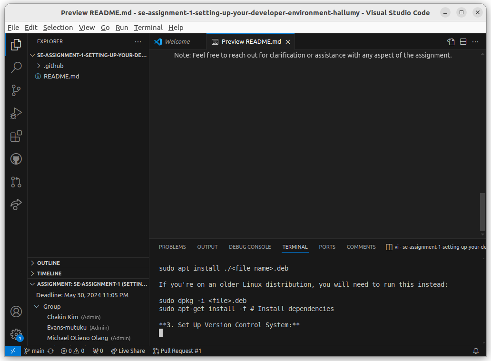
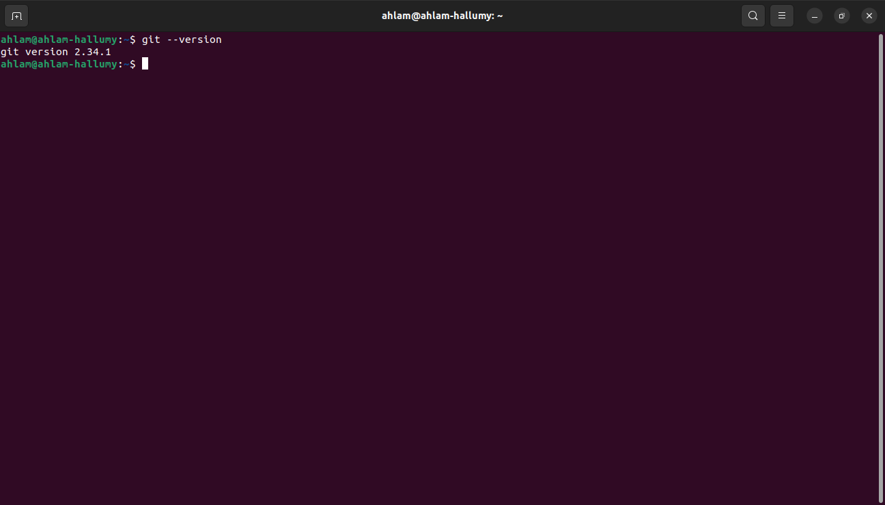
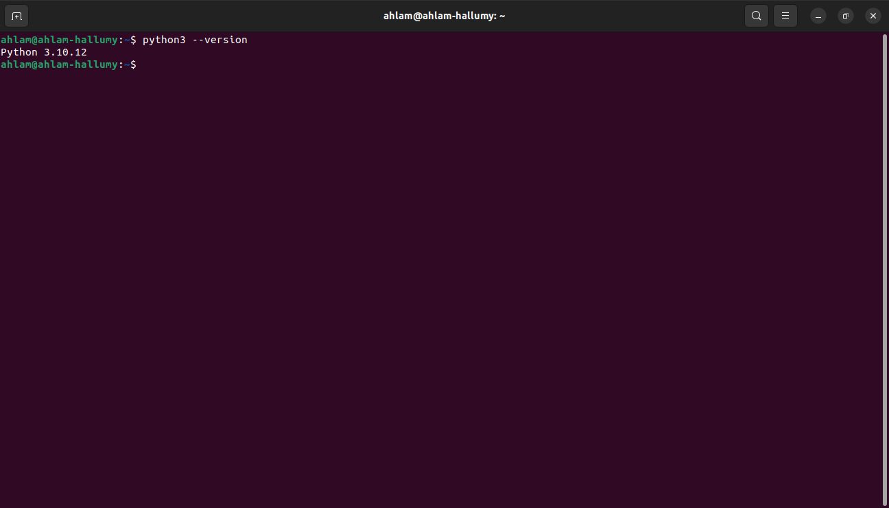
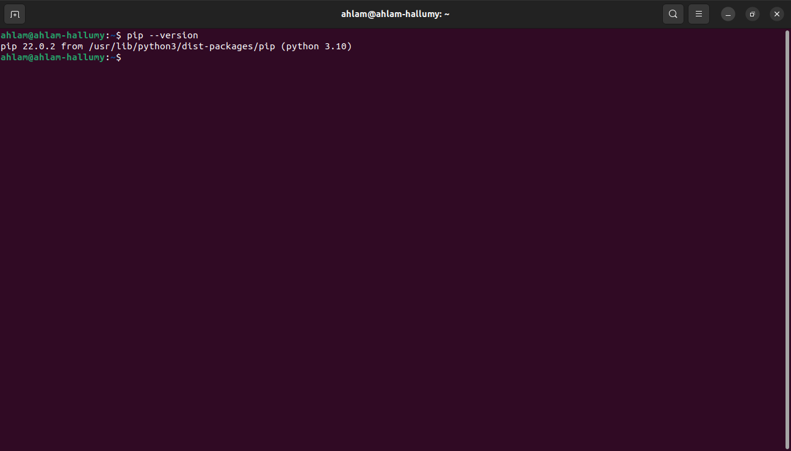
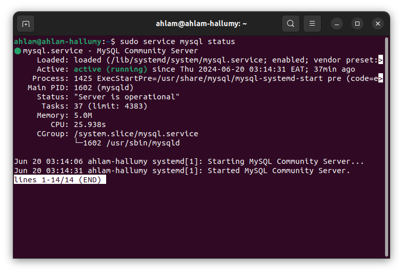
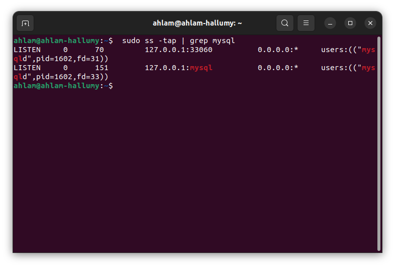

# Dev_Setup
Setup Development Environment

#Assignment: Setting Up Your Developer Environment

#Objective:
This assignment aims to familiarize you with the tools and configurations necessary to set up an efficient developer environment for software engineering projects. Completing this assignment will give you the skills required to set up a robust and productive workspace conducive to coding, debugging, version control, and collaboration.

#Tasks:

**1. Select Your Operating System (OS):**
  ** Choose an operating system that best suits your preferences and project requirements. Download and Install Windows 11. https://www.microsoft.com/software-download/windows11**

Download windows 11 from the windows download page

Agree to the terms and choose Accept. Let the Setup tool run, and choose the recommended options for this PC. Click Next, and choose USB flash drive.

Choose your USB flash drive from the list and then click Next. You'll be prompted and Windows 11 will download to it. Once finished, the installer will switch to Creating  Installation media. You'll know when it's finished, as you'll get a prompt that the drive is ready.

Once your USB drive is ready, close the installer with the Finish button. Keep the USB drive plugged into your PC.

Restart your PC

In the pop-up prompt, choose Use a device. Your USB drive should appear listed. Choose it, and Windows will restart to your USB drive and Windows 11 installer. If you don't see this option, you'll need to head into your BIOS or UEFI to manually boot from the USB drive. Usually, you can do this by pressing F12 on boot as soon as you turn on your PC. 

Once in the Windows 11 installer, select a language, and click Next. 

Choose the Custom option and choose the drive to install Windows 11 on. You might have to click the Format button to erase all your files on the drive. When done, select the drive again and click Next.

Windows 11 will install to your PC, and you can sit back. You'll then be taken to the out-of-box experience, and will be prompted to set up your PC again.

**2. Install a Text Editor or Integrated Development Environment (IDE):**
   **Select and install a text editor or IDE suitable for your programming languages and workflow. Download and Install Visual Studio Code. https://code.visualstudio.com/Download**

Go to the visual studio download page. Select your OS then click on it to download.

For Linux, download the .deb package 64-bit 

After the download, open your terminal and type the following:

sudo apt install ./<file name>.deb

If you're on an older Linux distribution, you will need to run this instead:

sudo dpkg -i <file>.deb

sudo apt-get install -f # Install dependencies

**3. Set Up Version Control System:**

   **Install Git and configure it on your local machine. Create a GitHub account for hosting your repositories. Initialize a Git repository for your project and make your first commit. https://github.com**
From your shell, install Git using apt-get:

$ sudo apt-get update
$ sudo apt-get install git

Verify the installation was successful by typing git --version:

$ git –version

Configure your Git username and email using the following commands, replacing John’s name with your own. These details will be associated with any commits that you create:

$ git config --global user.name "John Peter"
$ git config --global user.email "jpeter@gmail.com"

Initialize git using
$ git init 

**4. Install Necessary Programming Languages and Runtimes:**
 ** Instal Python from http://wwww.python.org programming language required for your project and install their respective compilers, interpreters, or runtimes. Ensure you have the necessary tools to build and execute your code.**

Open the shell and type

$  sudo apt update

Then type the following on the terminal

sudo apt install python[version number]

**5. Install Package Managers:**
   **If applicable, install package managers like pip (Python).**

Open Linux Terminal.

Update the current package using 

$ sudo apt update
 
Install PIP on Ubuntu using the command 

$ sudo apt install python3-pip.

**6. Configure a Database (MySQL): **
   **Download and install MySQL database. https://dev.mysql.com/downloads/windows/installer/5.7.html**

To install MySQL, run the following command from a terminal prompt:

$ sudo apt install mysql-server

Once the installation is complete, the MySQL server should be started automatically. You can quickly check its current status via system:

$ sudo service mysql status

To check the network status run:

$ sudo ss -tap | grep mysql

**7. Set Up Development Environments and Virtualization (Optional):**
  ** Consider using virtualization tools like Docker or virtual machines to isolate project dependencies and ensure consistent environments across different machines.**

8. Explore Extensions and Plugins:
   Explore available extensions, plugins, and add-ons for your chosen text editor or IDE to enhance functionality, such as syntax highlighting, linting, code formatting, and version control integration.

9. Document Your Setup:
    Create a comprehensive document outlining the steps you've taken to set up your developer environment. Include any configurations, customizations, or troubleshooting steps encountered during the process. 

#Deliverables:
- Document detailing the setup process with step-by-step instructions and screenshots where necessary.
- A GitHub repository containing a sample project initialized with Git and any necessary configuration files (e.g., .gitignore).
- A reflection on the challenges faced during setup and strategies employed to overcome them.

#Submission:
Submit your document and GitHub repository link through the designated platform or email to the instructor by the specified deadline.

#Evaluation Criteria:**
- Completeness and accuracy of setup documentation.
- Effectiveness of version control implementation.
- Appropriateness of tools selected for the project requirements.
- Clarity of reflection on challenges and solutions encountered.
- Adherence to submission guidelines and deadlines.

Note: Feel free to reach out for clarification or assistance with any aspect of the assignment.
